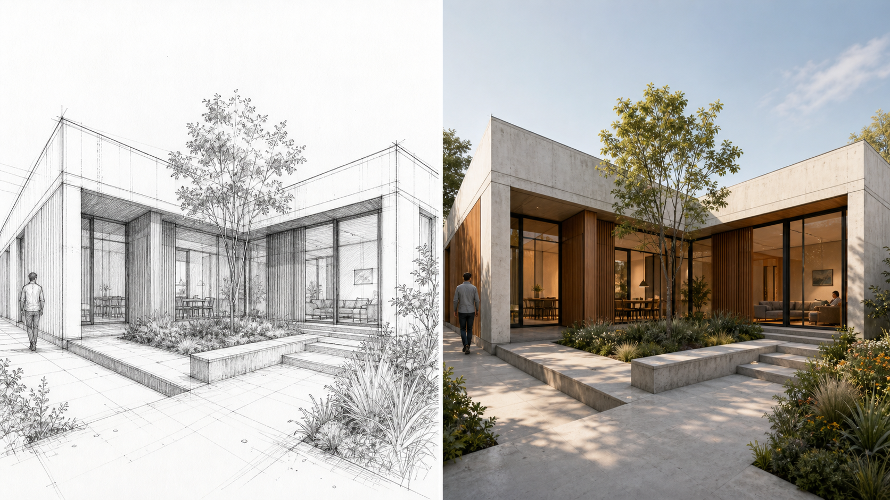

# Architectural Sketch and Rendering Concept

This self-initiated, AI-assisted concept shows the same fictional courtyard house as an architectural perspective sketch and a polished visualization. It is a workflow sample, not commissioned work and not a claim of manual hand drawing.

For paid work, the reference material, allowed production methods, dimensions, output format, revision limit, and usage rights must be agreed in writing before production starts.
